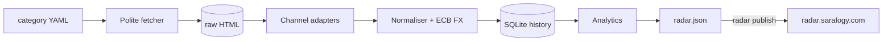

# Category Radar

**Category intelligence for Central Europe from public shelf data.** Category Radar scrapes the dominant price-comparison engine (or leading retailer) in six markets, normalises everything into one comparable dataset, and answers four questions every category or brand manager asks:

| Question | What you get |
|---|---|
| **Price**: where does the category sit, and how is it moving? | Median/P10–P90 per market in EUR, price distribution, brand price index, weekly price trend, price movers, identical-model cross-border price gaps |
| **Positioning**: who claims which space? | Brand map (price index × rating / feature richness / capacity), claim-ownership heatmap, price-tier mix |
| **Competitive landscape**: who owns the shelf? | Visibility-weighted share of shelf, share of voice (ratings), purchase share (PL), HHI concentration, pan-regional vs local brands, paid placements |
| **Market needs**: what does the market want? | Feature lift (top-20 vs whole shelf), review-need salience with pain-point colouring, capacity sweet spot, hard demand signals |

The first category is **air fryers** in **DE · AT · CH · PL · CZ · HU**. Any other category is a new YAML file.



Scraping runs on your own Mac. The website is a static dashboard that reads one JSON file. Design rationale: [ADR-001](docs/adr/ADR-001-architecture.md).

## Channels

| Market | Channel | Type | Signals |
|---|---|---|---|
| DE | geizhals.de | price comparison | lowest price, offers, rating, test score, 30-day price change, specs |
| AT | geizhals.at | price comparison | same as DE |
| CH | toppreise.ch | price comparison | lowest price (CHF), offers, spec line |
| PL | ceneo.pl | price comparison | price (PLN), shops, rating, **units bought in 90 days**, promoted flag |
| CZ | alza.cz | retailer (best-seller order) | price (CZK), rating, reviews, positioning copy, sponsored flag |
| HU | arukereso.hu | price comparison | price (HUF), offers, paid "brandbox" placements |

heureka.cz (CZ's comparison engine) answers with a bot challenge, so CZ uses Alza. The tool never bypasses CAPTCHAs or bot walls: a blocked channel is reported as `blocked`, not forced.

## Quick start (macOS)

```bash
cd ~/Projects/category-radar
python3 -m venv .venv && source .venv/bin/activate
pip install -e ".[browser,dev]"
playwright install chromium        # headless browser fallback for JS-heavy pages

pytest -q                          # 37 tests, offline
radar doctor                       # does every channel still fetch + parse? (~1 min)
radar run                          # full snapshot: scrape → store → analyse → export (~5–8 min)
radar report                       # print executive GTM dossier + save Markdown/HTML brief
radar serve                        # opens the dashboard at http://127.0.0.1:8000
```

Useful variations:

```bash
radar run --channels geizhals_de,ceneo_pl   # just some channels
radar run --no-reviews                      # skip product-page review mining (faster)
radar reparse --date 2026-10-06             # re-parse saved HTML after fixing a parser, no network
radar export                                # rebuild dashboard data from the database
radar report                                # print executive category brief
radar channels                              # list channels and adapters
```

Outputs:

- `data/radar.sqlite`: full history (runs, listings, reviews, FX rates)
- `data/raw/<date>/<channel>/page-N.html`: the exact HTML each run saw (audit trail, replayable)
- `data/exports/executive_brief_<date>.md`: C-suite / GTM category intelligence brief
- `data/exports/executive_brief_<date>.html`: print-ready executive dossier
- `data/exports/*.csv`: listings and brand scorecards, ready for Excel
- `site/data/radar.json`: the dashboard bundle

## Publish to radar.saralogy.com

One-time setup:

1. Create a **public** GitHub repo `saralogy/category-radar` and push this folder:
   ```bash
   git init && git add . && git commit -m "Category Radar v1"
   git branch -M main
   git remote add origin https://github.com/saralogy/category-radar.git
   git push -u origin main
   ```
2. On GitHub, go to **Settings → Pages → Source: GitHub Actions**. The `pages` workflow deploys `site/`.
3. At your DNS provider for saralogy.com, add a **CNAME** record: `radar` → `saralogy.github.io`.
4. On GitHub, go to **Settings → Pages → Custom domain**: `radar.saralogy.com`, then tick **Enforce HTTPS** once the certificate is issued (usually minutes).

After each run:

```bash
radar run && radar publish     # commits site/data/radar.json and pushes; the site redeploys in ~1 min
```

Only the aggregated dashboard bundle is published. The database and raw HTML stay on your Mac (`.gitignore`).

## Schedule it (weekly snapshots build the price history)

```bash
sed "s|__PROJECT_DIR__|$PWD|" scripts/com.saralogy.category-radar.plist > ~/Library/LaunchAgents/com.saralogy.category-radar.plist
launchctl load ~/Library/LaunchAgents/com.saralogy.category-radar.plist
```

This runs `scripts/weekly.sh` (`radar run && radar publish`) every Monday at 07:30 when the Mac is awake. Logs go to `data/logs/weekly.log`.

## How it works

```
config/airfryer.yaml      markets, channels, brand aliases, price tiers, claim + need lexicons (DE/PL/CS/HU)
src/category_radar/
  fetch.py                polite fetcher: robots.txt, per-host rate limit, retries, HTTP → headless-browser fallback
  channels/*.py           one adapter per site: HTML → RawListing (pure functions, fixture-tested)
  normalize.py            brand resolution, cross-market model key, litres/watts, claims, EUR conversion
  fx.py                   ECB reference rates
  reviews.py              schema.org review extraction (site-agnostic)
  store.py                SQLite schema + access
  analytics.py            price, positioning, landscape, needs, auto-generated insights
  export.py               dashboard JSON + CSVs
  pipeline.py, cli.py     orchestration and the `radar` command
site/                     static dashboard (HTML + vanilla JS + vendored Chart.js)
docs/adr/                 architecture decision record
```

Metric definitions are on the dashboard's **Data & method** tab and at the top of `analytics.py`.

### Add a market or channel

1. Add a channel block to the YAML (`market`, `adapter`, `start_url`, `max_pages`).
2. If the site is new, add `channels/<site>.py` with a class decorated `@register("<site>")` implementing `parse()` (and `next_page_url()` if pagination is unusual).
3. Save one listing page as `tests/fixtures/<site>.html` and add a test.
4. Run `radar doctor --channels <id>`.

### Analyse another category

Copy `config/airfryer.yaml` to, e.g., `config/robot-vacuum.yaml`, change the URLs, brands, claims and needs, then run `radar run --config config/robot-vacuum.yaml --data-dir data/robot-vacuum`.

## When a site changes its markup

The dashboard's **Data & method** tab shows each channel's status. `empty` means the page was fetched but nothing was parsed, so the selectors are out of date. Open `data/raw/<date>/<channel>/page-1.html`, update the selectors in `channels/<site>.py`, then run `radar reparse --date <date>` (no re-scraping needed).

Parser status as of 2026-10-06: geizhals, toppreise, ceneo and alza were checked against live markup. The árukereső adapter relies on link patterns and text and should be confirmed with `radar doctor` on the first run.

## Responsible use

Personal, non-commercial market research. Public category pages only, one request every ≥4 s per host, robots.txt honoured, no logins, no personal data, and no circumvention of bot protection. Publish aggregated insights, not bulk copies of anyone's catalogue, and check each site's terms before using the data commercially.

---
Built by **Berk Saraloglu**: integrated marketing communications × hands-on build. See [`docs/demo-script.md`](docs/demo-script.md) for the 5-minute interview walkthrough.
