# ADR-001: Category Radar architecture

**Status:** Accepted
**Date:** 2026-10-06
**Deciders:** Berk Saraloglu (owner)

## Context

I need a working category-intelligence tool to show in interviews. It has to answer four marketing questions for one category (air fryers) across six Central European markets (DE, AT, CH, PL, CZ, HU):

1. **Price:** where does the category sit, how is it moving, and where do identical products cost more across borders?
2. **Positioning:** which brand claims which price/quality space, and which claims does each brand own?
3. **Competitive landscape:** who owns the shelf, who owns the voice, and how concentrated is each market?
4. **Market needs:** which features does the market reward, and what do buyers actually talk about?

Constraints:

- **Personal project, €0 budget.** No paid APIs, proxies or cloud scraping services.
- **It runs on my Mac.** The scraping is mine, from my machine, on my schedule.
- **It must be demonstrable in 5 minutes** on any laptop through a public URL on `saralogy.com`, and it must not break live in an interview.
- **It must be honest scraping:** public pages only, robots.txt respected, rate-limited, no CAPTCHA/bot-wall circumvention.
- **One person maintains it.** Website markup changes, so a broken parser must be easy to spot and fix.

## Decision

A **local Python pipeline with a static dashboard**, with storage and hosting kept apart:

```mermaid
flowchart LR
  subgraph Mac["Berk's Mac (weekly via launchd)"]
    CFG[category YAML<br/>markets · channels · brands<br/>claims · needs lexicons] --> F
    F[Fetcher<br/>robots.txt · rate limit<br/>HTTP → headless browser fallback] --> RAW[(raw HTML<br/>data/raw/date/)]
    RAW --> A[Channel adapters<br/>geizhals · toppreise · ceneo<br/>alza · arukereso]
    A --> N[Normaliser<br/>brand · model key · litres · watts<br/>claims · ECB FX → EUR]
    N --> DB[(SQLite<br/>runs · listings · reviews · fx)]
    DB --> AN[Analytics<br/>price · positioning<br/>landscape · needs · insights]
    AN --> J[site/data/radar.json]
  end
  J -- radar publish<br/>git push --> GH[GitHub repo]
  GH -- Pages workflow --> WEB[radar.saralogy.com<br/>static dashboard]
```

Key choices:

| Concern | Choice | Why |
|---|---|---|
| Where scraping runs | My Mac, scheduled with launchd | Residential IP (comparison sites often block datacentre IPs), zero cost, data stays mine |
| Market "shelf" | One popularity-sorted category page per market on the dominant price-comparison engine (geizhals, toppreise, ceneo, árukereső); CZ uses Alza because heureka.cz serves a bot challenge | Comparison engines aggregate every retailer, so one page gives price, distribution breadth (offer count), ratings and popularity rank at once |
| Extensibility | Adapter registry: one class per site, each a pure function from HTML to `RawListing` | A new market or channel is about 60 lines plus a YAML entry. Adapters are unit-tested against saved HTML |
| Category logic | All category knowledge (URLs, brands, tiers, claim and need lexicons in DE/PL/CS/HU) lives in YAML | Switching to robot vacuums is a new YAML file, not a code change |
| Resilience | Raw HTML saved before parsing; each channel isolated; status recorded per channel; `radar doctor` health check; `radar reparse` replays saved HTML offline | A site redesign breaks one channel, visibly, and can be fixed and replayed without re-scraping |
| Storage | SQLite (stdlib) | Zero setup, full history for price tracking, portable |
| Currency | ECB daily reference rates, stored per run | Free, official and reproducible |
| Market needs | Reviews read from schema.org structured data (JSON-LD/microdata), tagged with a multilingual needs lexicon; plus "feature lift" (top-20 vs whole shelf) | One site-agnostic extractor. Two lenses: what buyers say (stated) and what the shelf rewards (revealed) |
| Front end | Static HTML + vanilla JS + vendored Chart.js reading one JSON file | No build step, works offline (`radar serve`), hosts free anywhere |
| Hosting | GitHub Pages with a custom domain (`radar.saralogy.com`) | Free HTTPS, deploys on push, and the source repo doubles as a code sample |

## Options considered

### Option A: Local Python pipeline + static site (chosen)

| Dimension | Assessment |
|---|---|
| Complexity | Low–Med |
| Cost | €0 |
| Scalability | Dozens of channels and weekly snapshots without trouble; not real-time |
| Familiarity | Python + HTML: readable for both tech and marketing interviewers |

**Pros:** free; honest residential scraping; nothing to keep alive at runtime; the demo never depends on a live scrape; history accumulates locally.
**Cons:** updates only when the Mac runs the job; SQLite isn't shared.

### Option B: Scheduled cloud scraper (GitHub Actions cron or a serverless function)

| Dimension | Assessment |
|---|---|
| Complexity | Med |
| Cost | €0–20/month |
| Scalability | Good |
| Familiarity | Med |

**Pros:** fully hands-off.
**Cons:** datacentre IPs are frequently blocked by comparison engines, so it would need paid proxies to be reliable. The data would then come from infrastructure I don't control, against the brief.

### Option C: Full web app (FastAPI + Postgres + React)

| Dimension | Assessment |
|---|---|
| Complexity | High |
| Cost | €10–30/month hosting |
| Scalability | High |
| Familiarity | Med |

**Pros:** live querying, multi-user.
**Cons:** far more surface area than a portfolio piece needs; a running server is something that can be down in the middle of an interview.

### Option D: Commercial data (Similarweb, Price2Spy, a scraping API)

**Pros:** clean data.
**Cons:** costs money, and it shows that I can buy a tool rather than that I can build the analysis.

## Trade-off analysis

The deciding forces are **reliability during a demo** and **honest, free data access**. Option A separates collecting data (local, scheduled, allowed to fail per channel) from presenting it (a static file, which can't fail). Option B fails on the second force, and C adds operational risk for no interview benefit. The cost is freshness: the dashboard is a weekly snapshot, not live. For category strategy, where decisions move monthly, that is the right granularity.

## Consequences

- **Easier:** adding a market or category (YAML + optional adapter); demoing offline; explaining every number (each metric has a one-sentence definition on the dashboard).
- **Harder:** keeping parsers current as sites change. Mitigated by fixtures, `radar doctor` and per-channel status on the dashboard.
- **Revisit:** if this becomes a product, move collection to a scheduled worker with consented data partners, and SQLite to Postgres.

## Action items

1. [x] Channel adapters for 6 markets with fixture tests
2. [x] Normalisation (brand, cross-market model key, capacity, claims, FX)
3. [x] Analytics: price, positioning, landscape, needs, auto-insights
4. [x] Static dashboard + Pages workflow for `radar.saralogy.com`
5. [ ] First real run on the Mac (`radar doctor`, then `radar run`)
6. [ ] DNS: CNAME `radar` → `saralogy.github.io`
7. [ ] Schedule weekly snapshots (launchd) so price history builds before interviews
8. [ ] Optional: second channel per market (e.g. idealo.de, allegro.pl) for channel-mix analysis
