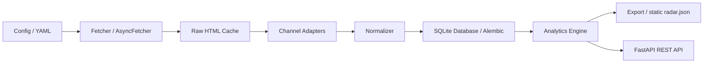

# Architecture

Category Radar follows a clean layered pipeline:

## Layers

1. **Extraction Layer**:
   - `Fetcher` (synchronous) and `AsyncFetcher` (asynchronous concurrent)
   - Polite robots.txt parsing and per-host rate limiting
   - Raw HTML cache written prior to parsing for auditability

2. **Adaptation Layer**:
   - Pluggable site-specific adapters extracting `RawListing` objects

3. **Normalization Layer**:
   - Model code canonicalization (`ninja:AF400`), spec extraction, and ECB currency conversion

4. **Persistence Layer**:
   - `Database` abstract interface with SQLite implementation (`Store`)
   - Alembic migrations for deterministic schema versioning

5. **Analytics & Presentation Layer**:
   - Pure statistical functions for pricing, landscape, positioning, and needs
   - Static site generator for GitHub Pages deployment
   - FastAPI server with health check probes and query endpoints
